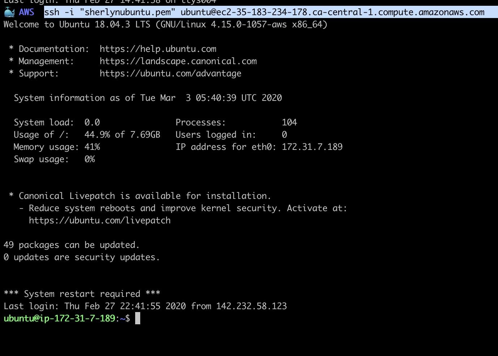

# MongoDB Database
{: .no_toc }

## Table of contents
{: .no_toc .text-delta }

1. TOC
{:toc}

---

# Introduction

The ways Amazon provides for deployment of MongoDB DB are similar to MySQL, either deploy on AWS EC2 instance, or create a DB instance on AWS RDS service. You will learn the first way through the following steps.

# Installation
The first two steps are the same for all the installation guidance.

1. Open a terminal, login to our AWS ubuntu instance.


2. (optional) Update the repositories and the ubuntu EC2 instance.
This step is needed only if you haven't done it when you first login.
```bash
$ sudo apt update -y && sudo apt upgrade -y
```


3. Download MongoDB PGP public key.
```bash
$ sudo wget https://www.mongodb.org/static/pgp/server-4.2.asc
```


The PGP (Pretty Good Privacy) is an encryption software, you can check detail definition in [Glossary](../Glossary.md). The encrypted public key file looks like below:


4. Add the key to APT key management utility.

```bash
$ sudo apt-key add server-4.2.asc
```
It shall return OK.

5. Create a list file for MongoDB. 
Use any text editor to open the source.list file in the directory */etc/apt*
```bash
$ cd /etc/apt
$ ls
$ sudo nano sources.list
```
Append the below at the end.
```
deb [ arch=amd64,arm64 ] https://repo.mongodb.org/apt/ubuntu bionic/mongodb-org/4.2 multiverse
```


6. Update local package database
```bash
$ sudo apt-get update
```


7. Install MongoDB
```bash
$ sudo apt-get install -y mongodb-org
```


8. Start MongoDB service
```bash
$ sudo systemctl start mongod
```

9. Verify if MongoDB has started successfully
```bash
$ sudo systemctl status mongod
```


# Configuration
The configuration file *mongod.conf* is stored in /etc/ directory. The default setting only consists basic configuration, such as storage path, system log, and network interfaces. you can modify the parameters to suit your need. 

```bash
$ cd /etc/mysql/mysql.conf.d
$ nano msqld.cnf
```


For example, the *bind-address* is set to 127.0.0.1 by default which is reserved for localhost (internal). you can change it to any IP address to which you want to grant the access right to our server, or 0.0.0.0 for allowing access from all IP address.

Besides all pre-defined setting, the *mongod.conf* file also lists some options that you can add, like security policy, or replication and sharding. More information can be found on MongoDB [official youbsite.](https://docs.mongodb.com/manual/)

# Conclusion

At this stage, you have a MongoDB database running on our AWS Ubuntu virtual machine that is ready for basic database development. you also get an idea on where to look at if you need to change its configuration.