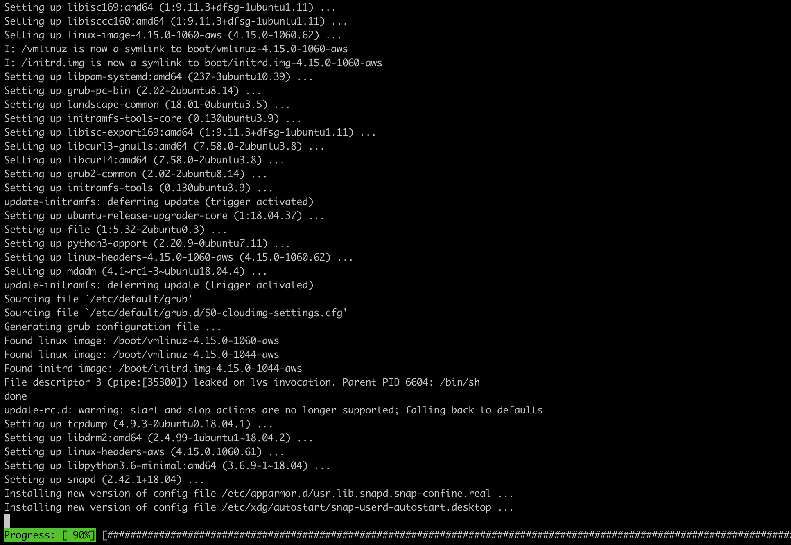

# Introduction
MongoDB, first released in 2009, is the most widely used NoSQL database. It is ranked first among document-oriented databases by DB-Engines. 

Being different from relational database using tables and restricted stable schema, MongoDB stores data objects as JSON-like documents inside a collection, thus it supports flexible data model that can accommodate data of any structure. 

The ways Amazon provides for deployment of MongoDB DB are similar to MySQL, we only cover the installation on EC2 instance in this manual.

# Installation
The first two steps are the same for all the installation guidance.

**Step 1.** Open a terminal, login to our AWS ubuntu instance.


**Step 2.** (optional) update the repositories and the ubuntu EC2 instance, if we haven't done it when we first login.
```bash
$ sudo apt update -y && sudo apt upgrade -y
```


**Step 3.** Download MongoDB PGP  public key.
```bash
$ sudo wget https://www.mongodb.org/static/pgp/server-4.2.asc
```


The PGP (Pretty Good Privacy) public key file looks like below:


**Step 4.** Add the key to APT key management utility.

```bash
$ sudo apt-key add server-4.2.asc
```
It shall return OK.

**Step 5.** Create a list file for MongoDB
Use any text editor to open the source.list file in the directory */etc/apt*
```bash
$ cd /etc/apt
$ ls
$ sudo nano sources.list
```
Append the below at the end.
```
deb [ arch=amd64,arm64 ] https://repo.mongodb.org/apt/ubuntu bionic/mongodb-org/4.2 multiverse
```


**Step 6.** Update local package database
```bash
$ sudo apt-get update
```


**Step 7.** Install MongoDB
```bash
$ sudo apt-get install -y mongodb-org
```


**Step 8.** Start MongoDB service
```bash
$ sudo systemctl start mongod
```

**Step 9.** Verify if MongoDB has started successfully
```bash
$ sudo systemctl status mongod
```


# Configuration
The configuration file *mongod.conf* is stored in /etc/ directory. The default setting only consists basic configuration, such as storage path, system log, and network interfaces. We can modify the parameters to suit our need. 

```bash
$ cd /etc/mysql/mysql.conf.d
$ nano msqld.cnf
```


For example, the *bind-address* is set to 127.0.0.1 by default which is reserved for localhost (internal). We can change it to any IP address to which we want to grant the access right to our server, or 0.0.0.0 for allowing access from all IP address.

Besides all pre-defined setting, the *mongod.conf* file also lists some options that we can add, like security policy, or replication and sharding. More information can be found on MongoDB [official website.](https://docs.mongodb.com/manual/)