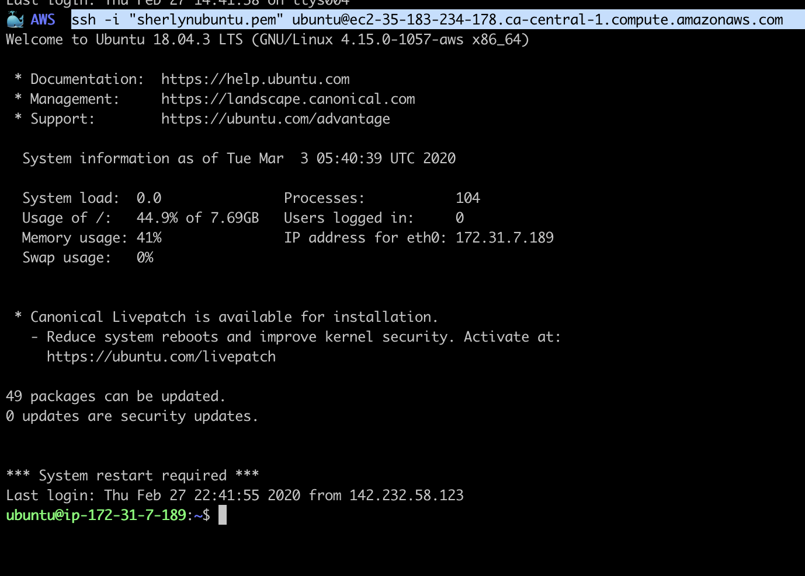
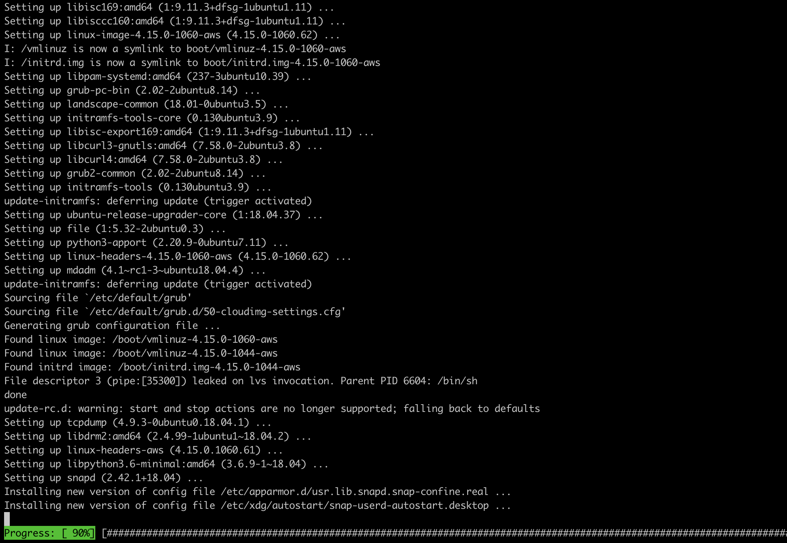
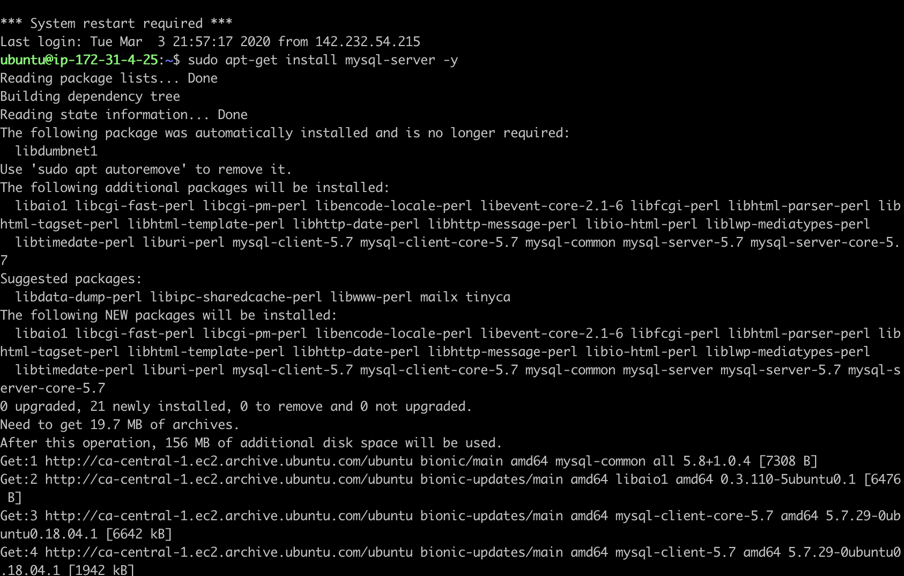
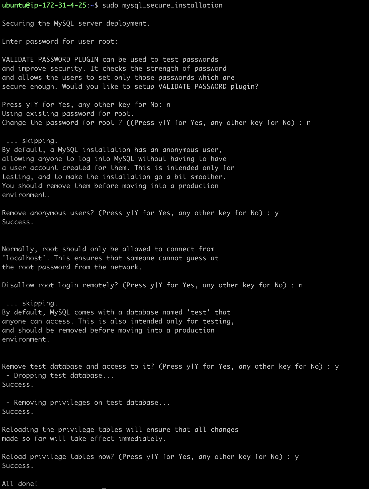
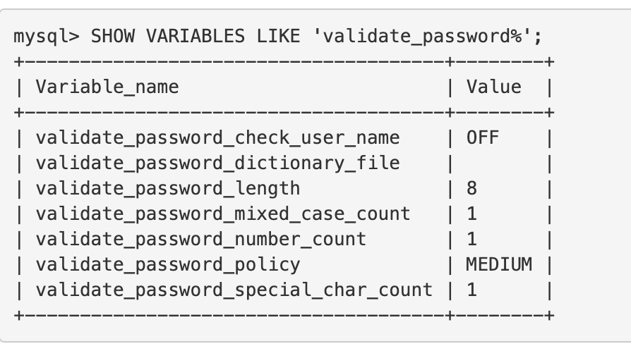
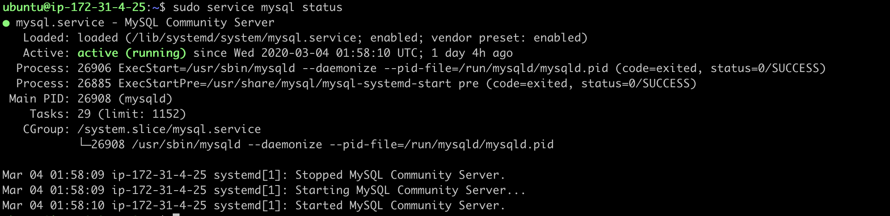
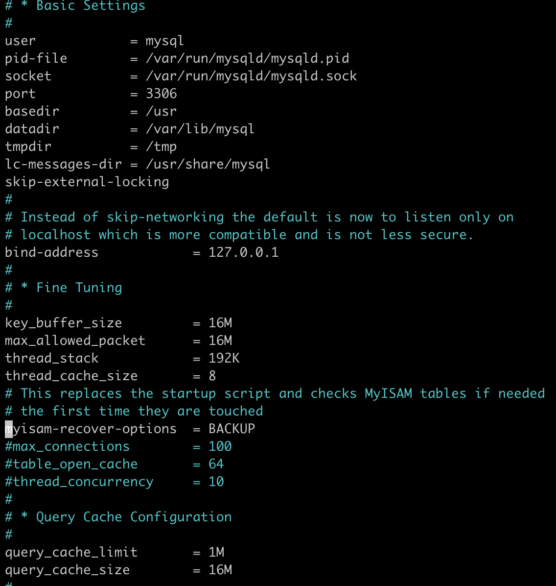

# Introduction
MySQL is s an open-source relational database management system. It was first released in 1995, since then it is gradually become the most popular DBMS - database management system.  
The latest release, 8.0 on April, 2018, introduced a great feature of Document Store. We now are able to store our JSON documents into collections and manage them using CRUD operations. The CRUD stands for cut, read, update, and delete.

There are various options to deploy MySQL database on Amazon cloud services, below lists two popular ways:
- Install MySQL on AWS EC2 instance,
- Create a DB instance on Amazon RDS.  
  
This manual focuses on deploying web stack environment on AWS, so we only introduce the first option.

# Installation
The first two steps are the same for all the installation guidance.

**Step 1.** Open a terminal, login to our AWS ubuntu instance.


**Step 2.** (optional) Update the repositories and the ubuntu EC2 instance, if we haven't done it when we first login.
```bash
$ sudo apt update -y && sudo apt upgrade -y
```


**Step 3.** Install MySQL server.
```bash
$ sudo apt-get install mysql-server -y
```


**Step 4** Improve MySQL server security.
*mysql_secure_installation* is a shell script that instructs us step by step to improve the security of our server.

```bash
$ sudo mysql_secure_installation
```
After enter the command, the script will prompt us to determine a series actions to perform.

- set VALIDATE PASSWORD plugin
    *VALIDATE PASSWORD* plugin serves to improve MySQL server's security by requiring account passwords and enabling strength testing of potential passwords.
    We could enter *n* to skip at this step. However if the plugin is enabled, it exposes a set of system variables which we can use to improve security of database. Follow steps below to list and modify those variables.
    **a.** Login to mysql shell
    ```bash
    $ mysql -u root -p
    ```
    The option:
    *-u* followed the username used to login 
    *-p* means to use password to login  

    Enter the password, then type the command below:
    ```mysql
    mysql> SHOW VARIABLES LIKE 'validate_password%';
    ``` 
    
    

    **b.** Use *SET GLOBAL* command configure password policy.
    ```bash
    mysql> SET GLOBAL validate_password_length = 6;
    mysql> SET GLOBAL validate_password_number_count = 0;
    mysql> SET GLOBAL validate_password.policy = LOW;
    ```
- new password
  Enter new password for root user.
- remove anonymous user
  Choose yes or no.
- disallow root login remotely
  MySQL server is normally configured for internal use, so only choose no when we plan to let remote server connects to our MySQL.
- remove test database and access it
  There is a test database by default can be access by anonymous users, we can remove it.
- reload privilege table

**Step 5** verify the MySQL server is running
We can try to login our server or use the below command to check if MySQL server is running.
```bash
$ sudo systemctl status mysql
```


Now we have the MySQL server ready for our database development.

# Configuration
The configuration file is located within *mysql.conf.d* folder, We can keep all the default setting; however, if we would like to verify the server's current configuration, we can use any text editor to open and modify the content.

```bash
$ cd /etc/mysql/mysql.conf.d
$ nano msqld.cnf
```


For example, the *bind-address* is set to 127.0.0.1 which is reserved for localhost (internal). We can change it to any IP address to which we want to grant the access right to our server, or 0.0.0.0 for allowing access from all IP address.
