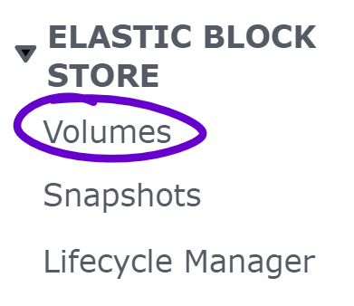
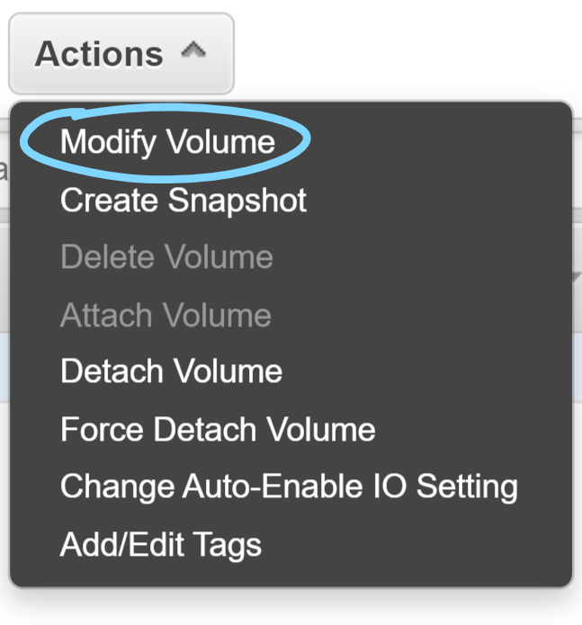
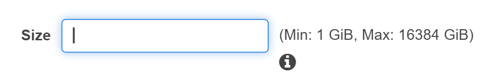

# Configure your Ubuntu Instance on AWS EC2
This section will cover configuring your Ubuntu instance on AWS EC2 🙌

## Introduction
AWS EC2 provides users with a robust set of options to configure Instances.

Two useful features of AWS which improve the usage of EC2 Instances are Elastic Block Storage (EBS) and Elastic IP.

The following sections will go over how to setup these services with your EC2 Instance.

---

## Elastic Block Storage (EBS)
Elastic Block Storage is a service which provides modular and easily scalable storage volumes
for AWS services, in our case an EC2 Instance.

Unlike the devices most people own such as a laptop or phone, the EC2 instance we have set up in the *Ubuntu Instance on AWS* section by default comes with only 8GB of storage 😮.

This is where EBS comes into play.

You may find that your Instance is filling up rather quickly in which case you can easily expand storage capacity with EBS by following the steps below.

1. Open the [AWS EC2 Console](https://console.aws.amazon.com/ec2)
2. Click **Volumes** under the "Elatic Block Storage" section in the sidebar

3. Select the volume you want to expand
4. Click the **Actions** dropdown and select **Modify Volume**

5. Enter your desired storage size in **Size**

6. Click **Modify** and confirm **Yes** when prompted

By this point the volume size has been expanded but you'll find that the filesystem size in your instance has not expanded.

To expand the filesystem to make use of the expanded volume size follow the steps below.

1. Connect to your instance with the command: `ssh ubuntu-aws`
2. Enter `df -h` to display filesystem sizes, `/dev/xvda1` is the filesystem we will expand
4. Enter `lsblk` to display the avaiable volume size, the expanded volume size will be shown next to `xvda`
5. Enter `resize2fs /dev/xvda1` to expand the filesystem into the total available space
6. Now enter `df -h` and you will see that `/dev/xvda1` is now using the entire volume size

## Elastic IP
AWS Elastic IP provide a static IP address that points to your EC2 Instance.

This is useful in the case that either you restart your instance manually or your instance crashes. Without Elastic IP every time your instance starts it will get reassigned a new dynamic IP which you will have to copy and paste into the `HostName` field of your ssh config file each time.

With Elastic IP you no longer have to re-enter the `HostName` address each time your instance restarts.

Allocate a new Elastic IP by following these steps:

1. Open the [AWS EC2 Console](https://console.aws.amazon.com/ec2)
2. Click **Elastic IPs** under the "Network and Security" section in the sidebar
3. Click **Allocate Elastic IP address**
4. Select **Amazon's pool of IPv4 addresses** then click **Allocate**

Setup your new Elastic IP with your instance by following the steps below.

1. Open the [AWS EC2 Console](https://console.aws.amazon.com/ec2)
2. Click **Elastic IPs** under the "Network and Security" section in the sidebar
3. Select your Elastic IP
4. Click the **Actions** dropdown and select **Associate Elastic IP address**
5. Under "Resource type" select **Instance**
6. Under "Instance" click the text field and select your instance
7. Click **Associate**

Now that you've associated your Elastic IP with your instance just update the `HostName` field in your ssh config with the Public DNS of your Instance (found in the Description panel of your Instance) and test out your Elatic IP connection by connecting with the follwing command: `ssh ubuntu-aws`

---

## Next Steps
Now your EC2 Instance is configured to be easily accesible over SSH and scalable for all your storage needs.

Go ahead and play around with your EC2 Instance or better yet deploy your web services that you've been itching to show the world 😊!
