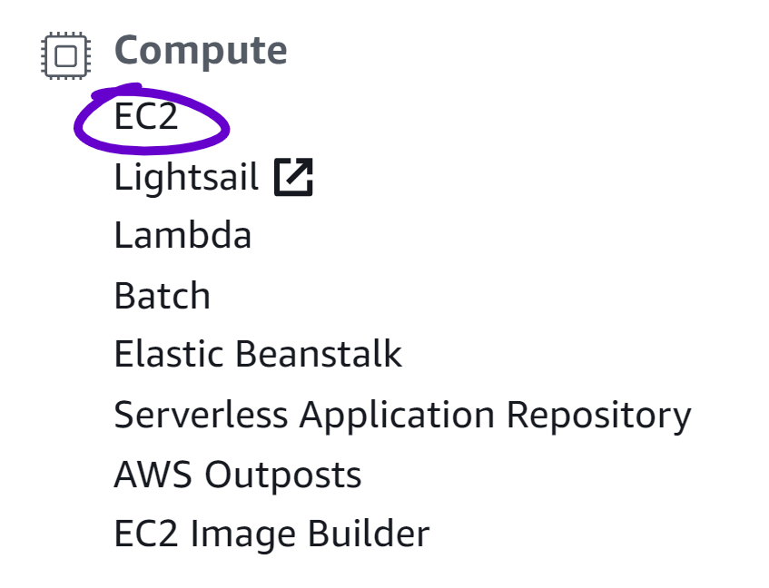

# Launch an Ubuntu Instance on AWS EC2
Follow this section to launch an Ubuntu instance on AWS EC2 🙌

## Introduction
First let's clarify what these abbreviations mean:
* AWS is Amazon Web Services
* EC2 is Elastic Compute Cloud 2

AWS EC2 is a service provided by Amazon for deploying scalable computing resources in the cloud on globally distributed AWS servers.

AWS provides users the ability to deploy computing resources such as a web server, database, or containers globally with minimal ceremony and industry grade support and reliability thanks to Amazon.

Without further ado, let's jump in.

---

## Launch an Ubuntu Instance
1. Go to [AWS](https://aws.amazon.com) and **Create a Free Account**

2. Open the [AWS Console](https://console.aws.amazon.com)
3. Open the EC2 Console by clicking **EC2** under the Compute section

4. Click **Running Instances**
5. Click **Launch Instance**

6. Select the Ubuntu Instance
7. Select **Configure Security Group** at the top
8. Select **Type** > **SSH** then select **Source** > **My IP**
9. Optionally enter a descriptive name for your machine
10. Click **Review and Launch** then **Launch**
11. You will be asked to **Select an existing key pair or create a new key pair**, go ahead and choose your preferred option then Launch your instance


## Setup your machine to connect to your Instance
1. Open your ssh config file: `~/.ssh/config`
2. Enter the following, replace the `<placeholders>` with your connection details (instructions for where to find these details are below),
and save the file:

```
Host ubuntu-aws
  User ubuntu
  HostName <public dns>
  IdentityFile <absolute path to key pair file>
  LocalForward <local port> localhost:<remote port>
```

* `Host` can be any name you want (here we'll use `ubuntu-aws`)
* `User` should be the default user name for your distro (for Ubuntu it's, perhaps unsurprisingly, `ubuntu`)
* `HostName` is the Public DNS of your Instance (found in the Description panel of your Instance)

* `IdentityFile` is the absolute path to the key pair file for your instance
* Optionally setup port forwarding with `LocalForward` to access remote ports on your local machine (ie. on your instance you have a server process serving on remote port `80` which you can map to port `8080` on your local machine with `LocalForward 8080 localhost:80`)
* Tip: you can forward multiple ports by adding another `LocalForward` line in your ssh config


## Connect to your Instance
1. Open your terminal
2. Enter the following command: `ssh ubuntu-aws`
3. Profit 🤑

The terminal will output a long message which summarizes your instance details.

Your terminal is now connected to the terminal of your EC2 Instance over SSH.

Now any command you type in the terminal will be run on your instance,
go ahead and try entering `ls` and `cd` commands to navigate the filesystem.

---

## Conclusion and Next Steps
Now you have launched a Ubuntu Instance on AWS EC2,
setup your machine to connect to your
instance, and connected to your instance over ssh.

Next we will begin to go over how to setup a LAMP stack on your instance.
