# Introduction
Apache HTTP Server is one of the most popular web servers used in serving websites. It is written in C and XML, and was initially released on 1995.

Apache is open sourced, which means anyone can adapt the source code for specific purpose, thus it supports a variety of features, many are implemented as external extensions or add-ons above the core functionalities.

Some widely used features are:
- Static content serving
It enables automatically handling of static files, index files, auto-indexing and content negotiation.  
- Virtual hosting
It allows a single Apache server serves many different websites.
- Mod-gzip
An external module, used for compression or decompression, helps reduce the size (weight) of web pages served over HTTP.

We will introduce the first two features at the configuration section.

# Installation
The first two steps are the same for all the installation guidance.

**Step 1.** open a terminal, login to our AWS ubuntu instance.


**Step 2.** (optional) update the repositories and the ubuntu EC2 instance, if we haven't done it when we first login.
```bash
$ sudo apt update -y && sudo apt upgrade -y
```

**Step 3.** install Apache server
```bash
$ sudo apt-get install apache2 -y
```
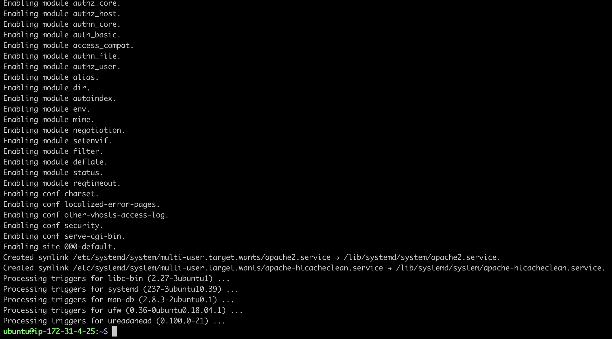

**Step 4.** Verify the installation succeeded.
We can enter the public dns or IP address of our instance in any browser to check if we are able to access the web server.

> Trouble shooting:
If it fails to open the default page, we can further check from two aspects:
>1. Whether the Apache server is running.
>2. Does the security group of our instance have HTTP port 80 open.
  
**Step 5.** Verify the Apache server is running.
By default, Apache server will start automatically after installation, but we can check if the apache server is running by entering the command. 
```bash
$ systemctl status apache2.service
```
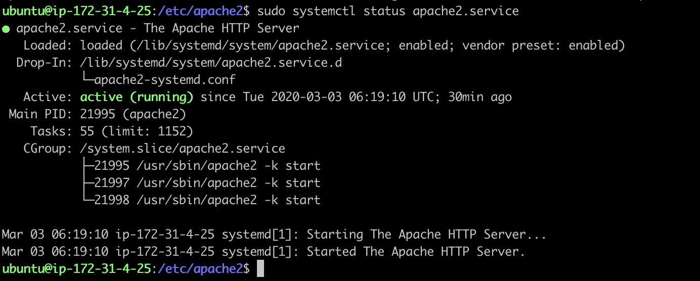
The screenshot above shows the server is running, if it shows opposite, enter the command below to start the server.
```bash
$ sudo systemctl start apache2.service
```
We can also use *systemctl* command to stop or restart Apache server.
```bash
# To stop the server
$ sudo systemctl stop apache2.service
# To restart the server
$ sudo systemctl restart apache2.service
```

**Step 6.** Check if the security group of our instance has the HTTP port 80 added in the inbound rules.
- Go to the AWS management console, 
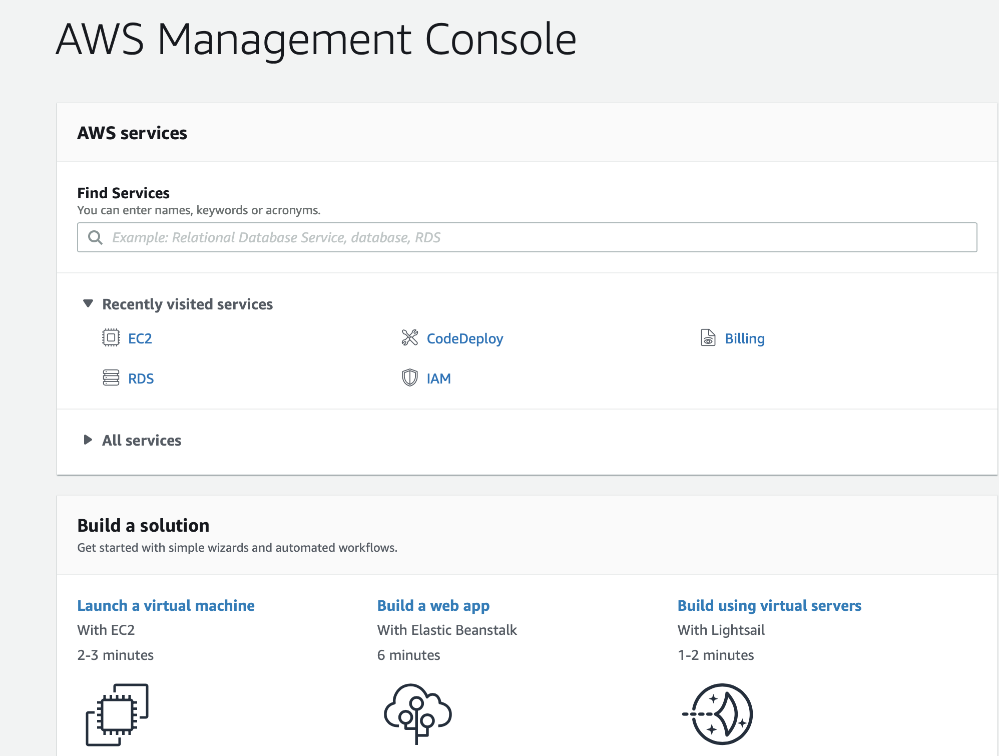
- click EC2, 
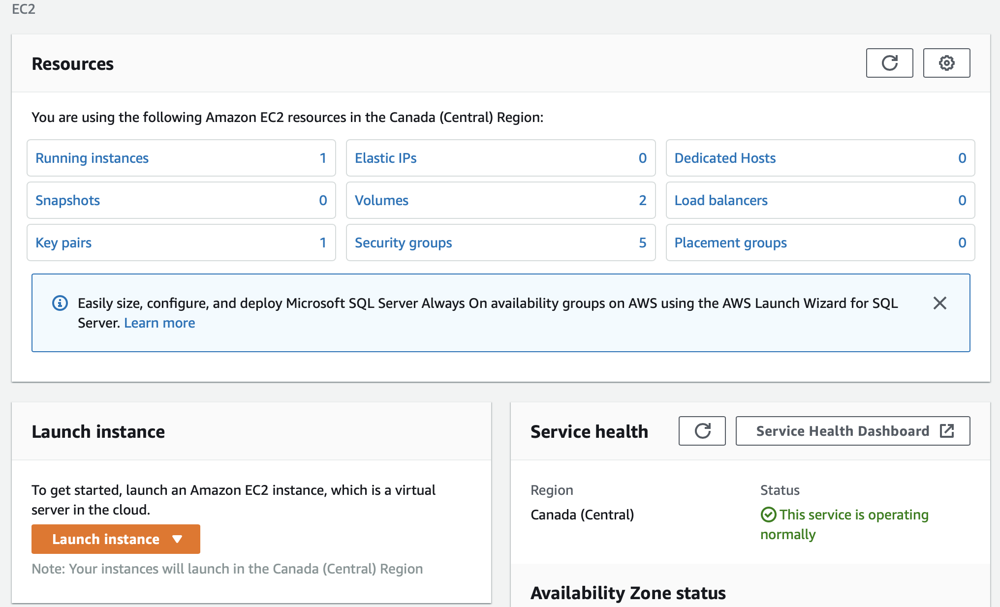
- then click running instances, select the instance,
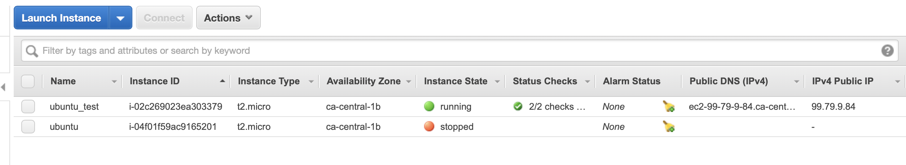
- in the description section, find the Security groups, 
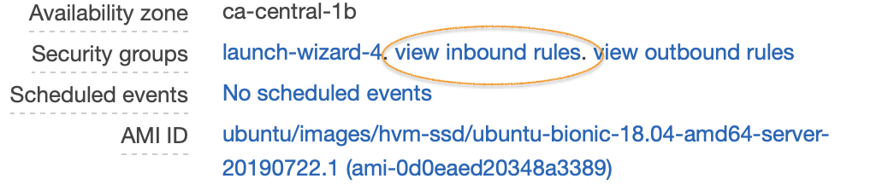
- click view inbound rules to verify if the HTTP port 80 is in the list,
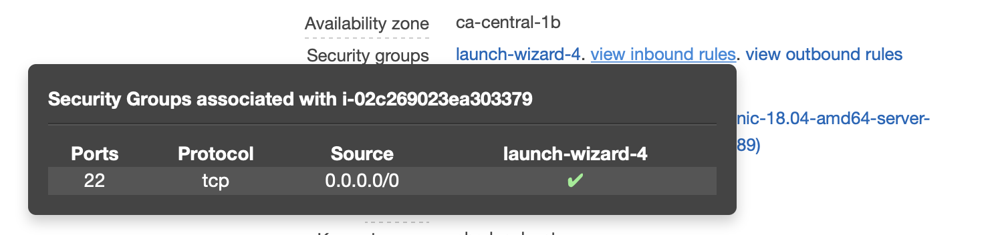
- if not, click the security groups at the side bar under network & security section,
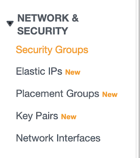
- find the security group that implied to our instance, launch-wizard-4 in the example,
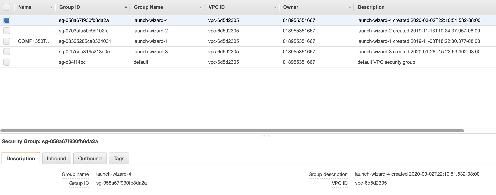 
- edit the inbound rules to add HTTP 80 port.
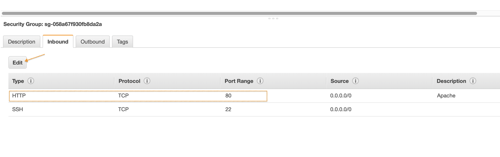

Now try again in the browser to open the default page. If the below page shows, we can confirm that we have our Apache server setup.
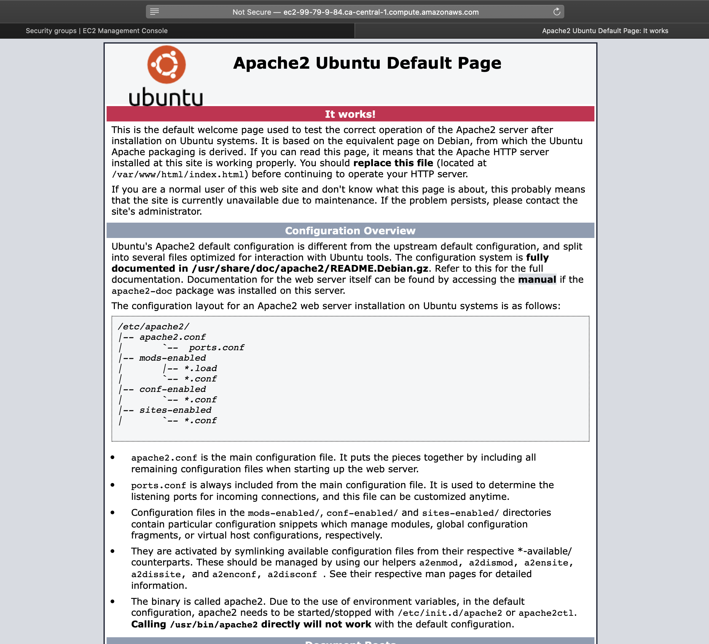

# Configuration

**Access configuration folder**

Linux stores all the system configuration files within the folder "etc". We can follow the instruction below to go to "apache2" folder and list all the content.  
```bash
# change directory to /etc/apache2
$ cd /etc/apache2
# list all the content in this apache2
$ ls
```
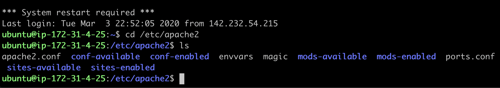

**Main configuration file**

Apache's configuration statements are split into several files forming the configuration hierarchy, which is shown in the main configuration file *apache2.conf*. We can use any text editor to open this file within the terminal, and the example uses ubuntu's build-in nano text editor. 
```bash
etc/apache2$ nano apache2.conf 
```

The tree structured files allow us to category the configuration and group the main file works as a link to include all those configuration files together when server starts up. 

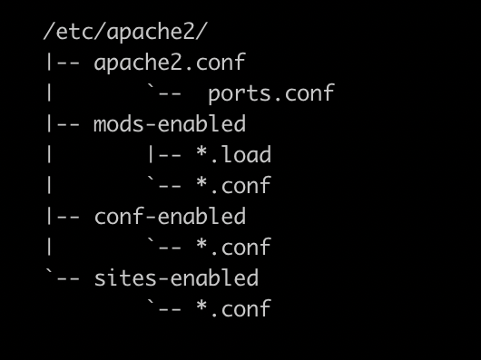

We normally do not need to change most of default configurations, there are two files that we may modify to suit our purpose.
*port.conf* defines which port the server is listening to for incoming request.
By default, port 80 reserve for HTTP, and port 443 for HTTPS, if we want our server to listen to other port, we can modify it here.
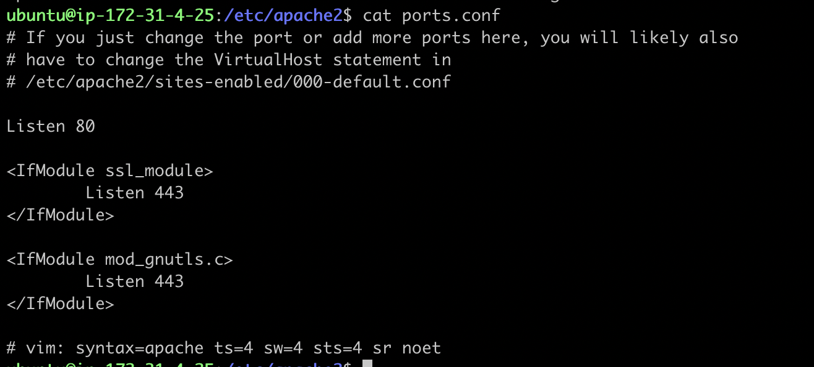

*000-default.conf*, located within the folder site-enabled, contains all the configuration of virtual host. Apache server has not set a limit about how many virtual host a single server can handle. 
We can add as many as the performance meets our expectation. Each virtual host is identified by ServerName and port.

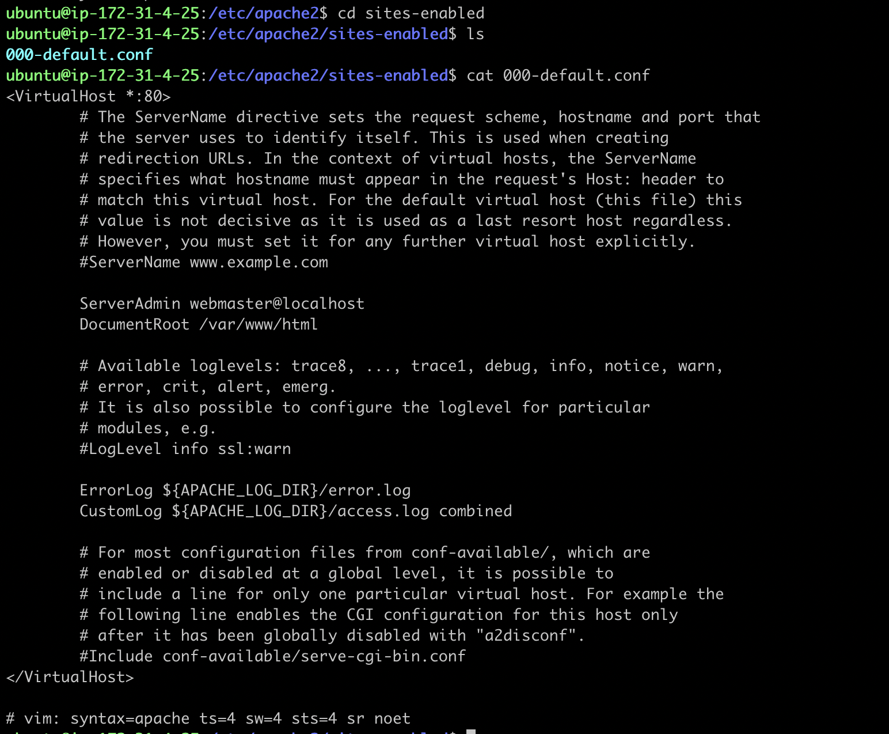