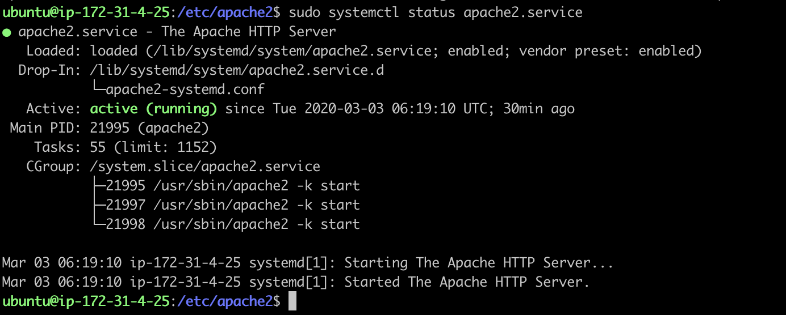
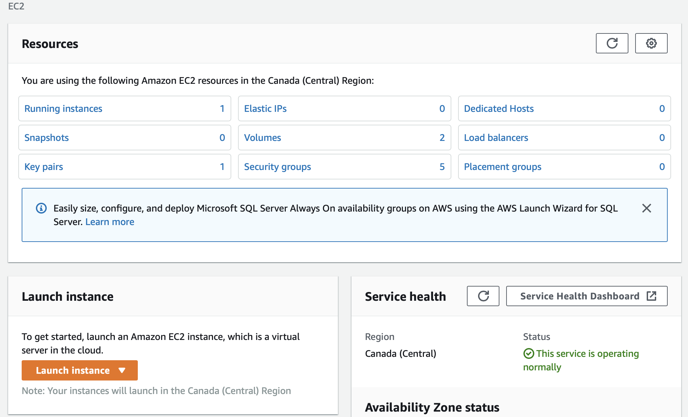
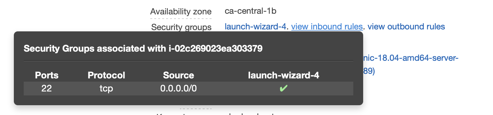

# Apache Troubleshooting
{: .no_toc }

## Table of contents
{: .no_toc .text-delta }

1. TOC
{:toc}

---

### Troubleshooting:
By default, Apache server will start automatically after installation.If the default page does not show after installation, you can further check from two aspects:
>1. Whether the Apache server is running.
>2. Does the security group of our instance have HTTP port 80 open.
  
**1.** Verify the Apache server is running.
By entering the below command in a terminal, you can get the service's status print out, as well as few latest lines from log file.
```bash
$ systemctl status apache2.service
```

The screenshot above shows a normal active (running) server. If it shows opposite, enter the command below to start the server.
```bash
$ sudo systemctl start apache2.service
```
you can also use *systemctl* command to stop or restart Apache server.
```bash
# To stop the server
$ sudo systemctl stop apache2.service
# To restart the server
$ sudo systemctl restart apache2.service
```

If the status shows the server is running, while you still can not get access to the default page, go to next step.

**2.** Check if the security group of our instance has the HTTP port 80 added in the inbound rules.
- Go to the AWS management console, 
 
</br>  
a. click EC2, 

</br> 
b. click running instances, select the instance,  

</br> 
c. find the Security groups in the description section, 

</br> 
d. click view inbound rules to verify if the HTTP port 80 is in the list,

</br> 
e. if not, click the security groups at the side bar under network & security section,

</br> 
f.find the security group that implied to our instance, launch-wizard-4 in the example,
 
</br> 
g. edit the inbound rules to add HTTP 80 port.


Now try again in the browser to open the default page. If the below page shows, you can confirm that you have the Apache server setup correctly.
