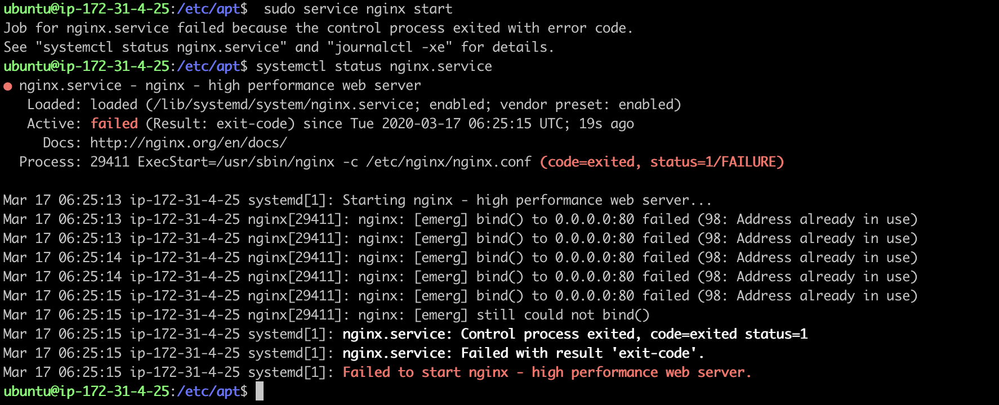
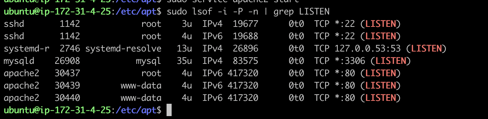
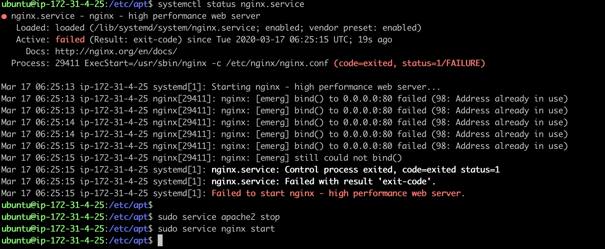
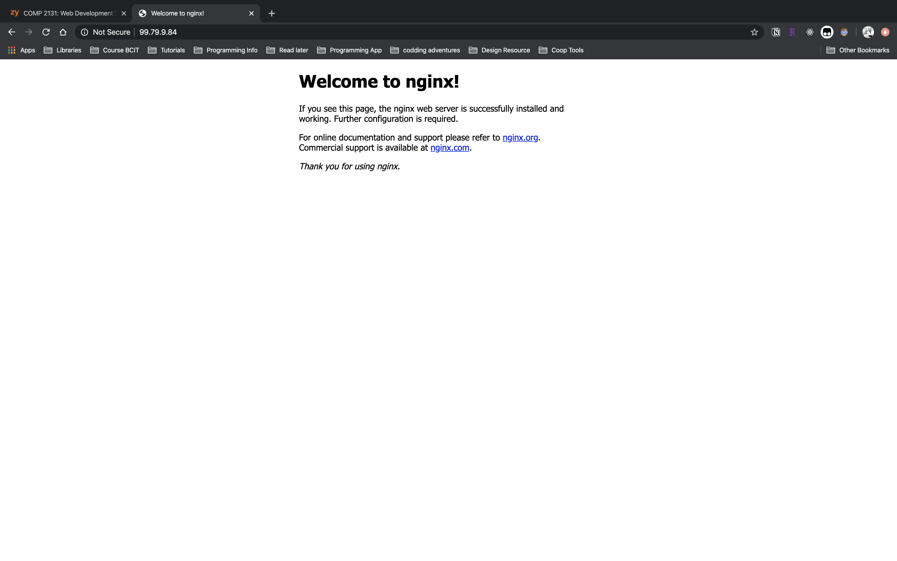

# Nginx Trouble Shooting
{: .no_toc }

## Table of contents
{: .no_toc .text-delta }

1. TOC
{:toc}

---
### Trouble shooting
If the server does not start properly, we can use below command to check the server status.

```bash
$ systemctl status nginx.service
```

This command will print out the service status, as well as first few log lines, which is very useful for targeting the problem when something goes wrong.  

In the screenshot above, the log message shows the service failed to start due to default address:0.0.0.0:80 has already been in use, which could be caused by another web server, like Apache, listening to the same port. Enter following command to list the applications and the associated ports they are listening to.
```bash
$sudo lsof -i -P -n | grep LISTEN
```

After we find out the application that occupies the address, Apache in this case, we have two options to resolve the problem:
1. stop the currently running service, and restart Nginx again. 
2. modify Nginx' configuration to bind to another port.
Here, We stop Apache first to test if Nginx installed correctly. We will introduce the second solution later.

If no error message prints out, go back to the browser and refresh the page. We shall be able to see the following web page.


