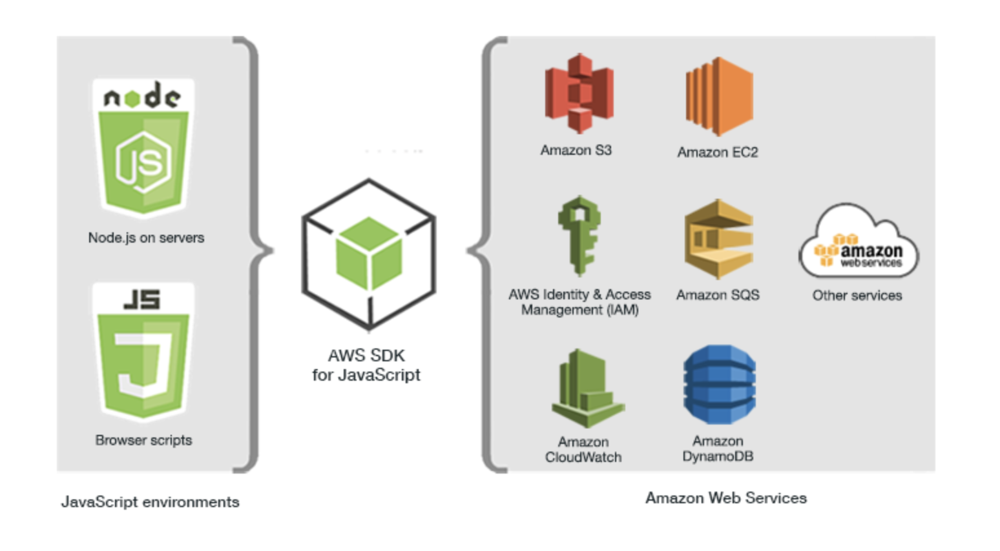

# Node.js web server
{: .no_toc }

## Table of contents
{: .no_toc .text-delta }

1. TOC
{:toc}

---


# Introduction

Node.js is a JavaScript runtime which allows developers to build web application using Javascript from front-end to back-end. This manual introduces the process to setup the Node.js environment on AWS, as well as the installation of AWS SDK for Javascript as an option.

# Installation
The first two steps are the same for all the installation guidance.

1. Open a terminal, login to our AWS ubuntu instance.


2. (optional) Update the repositories and the ubuntu EC2 instance.
This step is needed only if you haven't done it when you first login.
```bash
$ sudo apt update -y && sudo apt upgrade -y
```


3. Install *nvm* Node Version Manager.
```bash
$ wget -qO- https://raw.githubusercontent.com/nvm-sh/nvm/v0.35.3/install.sh | bash
```
The command downloads a script file and runs it to install *nvm*, which enables users to install multiple versions of node and switch between them. 


4. Active *nvm*
run the command below to active the nvm.
```bash
$ . ~/.nvm/nvm.sh
```
you can verify the installation by type the following command then.
```bash
$ command -v nvm
```
It shall print out nvm in the terminal. 

5. Install the latest version of node using *nvm*.
```bash
$ nvm install node
```
The installation also has *npm*, Node Package Manager, installed, which can be used to install additional third party modules. 


6. Verify node installed successfully.
```bash
$ node --version
```
The command prints out the node version installed.


After finishing all the steps above, the environment is ready for building Node.js application.

# AWS SDK for Javascript

Node.js provides a collection of built-in modules, as well as huge amount of third party code that you can use to build application; however, if you plan to integrate more AWS services, such as Amazon S3, DynamoDB, into your application, you need to install AWS SDK for Javascript.

AWS SDK for Javascript is a JavaScript API Amazon provides for accessing AWS services. The image below shows the services that are available in the SDK.


Install SDK for Node.js is the same as installing other modules using npm. Inside the project folder, run the following command in the terminal.
```bash
$ npm install aws-sdk
```
If you just created our project folder, make sure to type *npm init -y* first to initialize the project and create a package.json file.


More information about the SDK can be found on [Amazon SDK for javascript in Nodejs.](https://aws.amazon.com/sdk-for-node-js/)

# Conclusion

Being different from other two web servers introduced in this user manual, the installation success of Nodejs on AWS only gives you a runtime environment which allows you to build application in Javascript, including create a server. At this stage, therefore, you can either code your program from start within this environment, or deploy your pre-build project into it.
