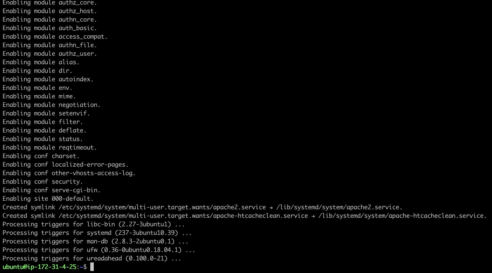
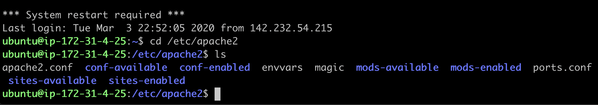
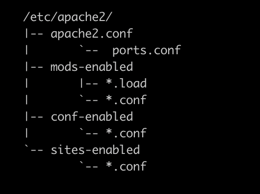
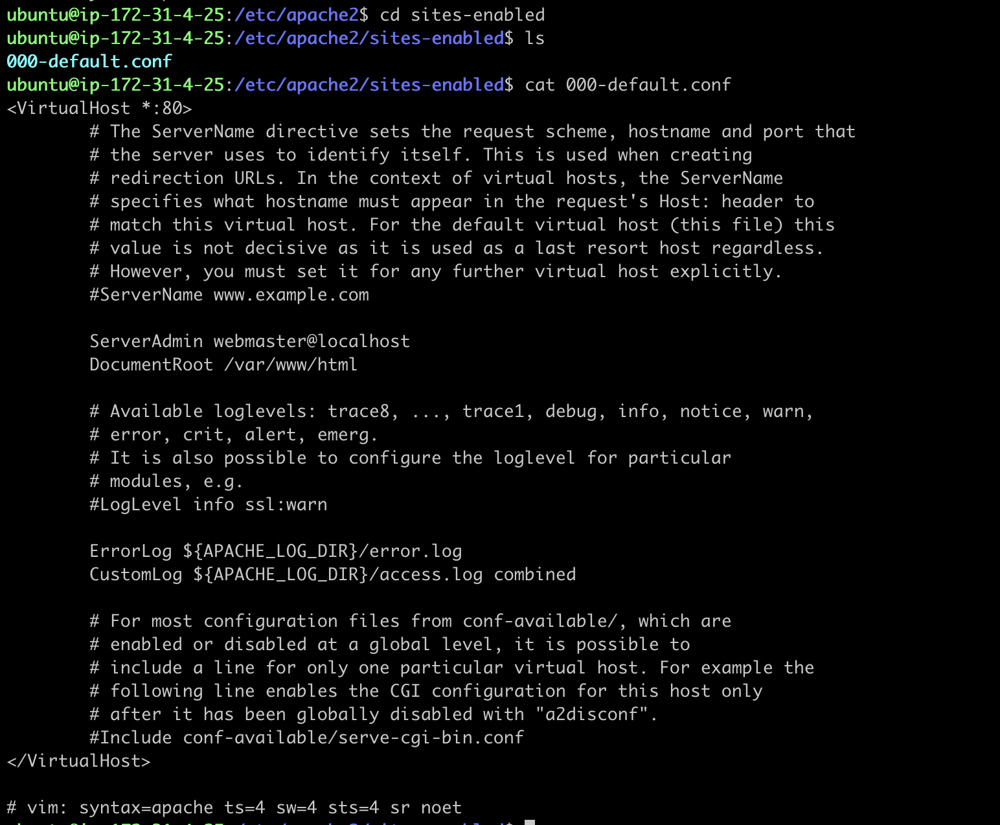

# Apache web werver
{: .no_toc }

## Table of contents
{: .no_toc .text-delta }

1. TOC
{:toc}

---

# Introduction
Apache has the largest open source community that contributes a huge pool of features. This manual includes a widely used one - virtual hosting - into the configuration section, after guiding you through the installation process.

# Installation
The first two steps are the same for all the installation guidance.

1. Open a terminal, login to our AWS ubuntu instance.


2. (optional) Update the repositories and the ubuntu EC2 instance.
This step is needed only if you haven't done it when you first login.
```bash
$ sudo apt update -y && sudo apt upgrade -y
```

3. Install Apache server.
```bash
$ sudo apt-get install apache2 -y
```


4. Verify the installation succeeded.
you can enter the public dns or IP address of your instance in any browser to check if you are able to access the web server's default page.
If the following page shows, then the web server has been installed successfully. 


If it fails to open the default page, check the [trouble shooting](/docs/troubleshooting/apache.md) section for solution.

# Configuration

**Access configuration folder**

Linux stores all the system configuration files within the folder "etc". you can follow the instruction below to go to "apache2" folder and list all the content.  
```bash
# change directory to /etc/apache2
$ cd /etc/apache2
# list all the content in this apache2
$ ls
```


**Main configuration file**

Apache's configuration statements are split into several files forming the configuration hierarchy, which is shown in the main configuration file *apache2.conf*. you can use any text editor to open this file within the terminal, and the example uses build-in nano text editor. 
```bash
etc/apache2$ nano apache2.conf 
```

The tree structured files allow users to category the configuration and the main file works as a link to include all those configuration files together when server starts up. 



Normally, you do not need to change most of default configuration for basic usage, while there are two files that you need to know. 
*port.conf* defines which port the server is listening to for incoming request.
By default, port 80 reserve for HTTP, and port 443 for HTTPS, if you want the server to listen to other port, you can modify it here. This setting can also resolve port conflicts when multiple web servers running on the same machine.


*000-default.conf*, located within the folder site-enabled, contains all the configuration of virtual host. Apache server has not set a limit about how many virtual host a single server can handle. 
you can add as many as the performance meets your expectation. Each virtual host is identified by the values of ServerName and port number.



# Conclusion

After finishing all above, you now have an Apache web server ready to serve website content on an AWS EC2 instance. You also have a general understanding on how to change an Apache server's default setting and configure virtual host for hosting multiple websites. 
