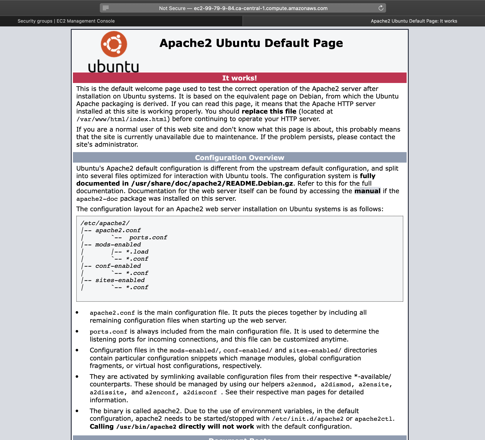

# Apache Web Server
{: .no_toc }

## Table of contents
{: .no_toc .text-delta }

1. TOC
{:toc}

---

# Introduction
Apache has the largest open source community that contributes a huge pool of features. We include a widely used one - virtual hosting - into the configuration section, after we guide  through the installation process.

# Installation
The first two steps are the same for all the installation guidance.

**Step 1.** Open a terminal, login to our AWS ubuntu instance.


**Step 2.** (optional) Update the repositories and the ubuntu EC2 instance.
This step is needed only if we haven't done it when we first login.
```bash
$ sudo apt update -y && sudo apt upgrade -y
```

**Step 3.** Install Apache server.
```bash
$ sudo apt-get install apache2 -y
```


**Step 4.** Verify the installation succeeded.
We can enter the public dns or IP address of our instance in any browser to check if we are able to access the web server's default page.
If the following page shows, then our web server has been installed successfully. 


If it fails to open the default page, check the [trouble shooting](/docs/troubleshooting/apache.md) section for solution.

# Configuration

**Access configuration folder**

Linux stores all the system configuration files within the folder "etc". We can follow the instruction below to go to "apache2" folder and list all the content.  
```bash
# change directory to /etc/apache2
$ cd /etc/apache2
# list all the content in this apache2
$ ls
```


**Main configuration file**

Apache's configuration statements are split into several files forming the configuration hierarchy, which is shown in the main configuration file *apache2.conf*. We can use any text editor to open this file within the terminal, and the example uses build-in nano text editor. 
```bash
etc/apache2$ nano apache2.conf 
```

The tree structured files allow us to category the configuration and group the main file works as a link to include all those configuration files together when server starts up. 


We normally do not need to change most of default configuration for basic usage, while there are two files that we may need to  take a look our purpose.
*port.conf* defines which port the server is listening to for incoming request.
By default, port 80 reserve for HTTP, and port 443 for HTTPS, if we want our server to listen to other port, we can modify it here.


*000-default.conf*, located within the folder site-enabled, contains all the configuration of virtual host. Apache server has not set a limit about how many virtual host a single server can handle. 
We can add as many as the performance meets our expectation. Each virtual host is identified by the values of ServerName and port number.


# Conclusion

 We have an Apache web server running on an AWS EC2 instance. The server is ready to serve our website content. We also know how to change our Apache server's default setting and configure virtual host for hosting multiple websites. 
