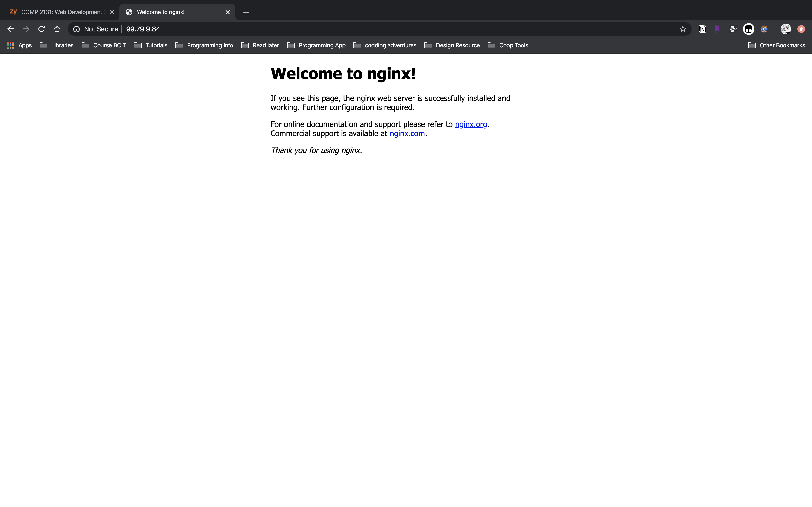

# Nginx web server
{: .no_toc }

## Table of contents
{: .no_toc .text-delta }

1. TOC
{:toc}

---

# Introduction

Nginx is a free and open-sourced software, but there is also a paid version Nginx Plus which provides some exclusive enterprise-grade features. Nginx Plus can be deployed directly from AWS's Marketplace, which is out of the scope of this manual. 

The manual will guide you step by step to setup the free version of Nginx on AWS EC2 instance.

# Installation
The first two steps are the same for all the installation guidance.

1. open a terminal, login to our AWS ubuntu instance.


2. (optional) Update the repositories and the ubuntu EC2 instance.
This step is needed only if you haven't done it when you first login.
```bash
$ sudo apt update -y && sudo apt upgrade -y
```

3. Download nginx (GPG) public key.
Nginx uses GPG (Gnu Privacy Guard) keys on its RPM packages and Debian/Ubuntu repositories so that users can verify the integrity and origin of the downloaded package. 
The GPG (Gnu Privacy Guard) is an encryption software, you can check detail definition in [Glossary](../Glossary.md). 

```bash
$ sudo wget http://nginx.org/keys/nginx_signing.key
```


4. Add the key to APT key management utility.

```bash
$ sudo apt-key add nginx_signing.key
```

5. Create list file for Nginx.
*source.list* is the main Apt sources configuration file in Linux system. you can use any text editor to open it in the directory */etc/apt/*.
```bash
$ cd /etc/apt   
$ ls
$ sudo nano sources.list
```
Append the following two lists at the end.

```
deb [arch=amd64] http://nginx.org/packages/mainline/ubuntu/ bionic nginx
deb-src http://nginx.org/packages/mainline/ubuntu/ bionic nginx
```
> **Note:** *bionic* represents the Ubuntu version, here is 18.04. Change this value according to Ubuntu version installed. 
> 


6. Update local package database.
```bash
$ sudo apt-get update
```

7. Install Nginx.
```bash
$ sudo apt-get install nginx
```


8. Start Nginx service.
```bash
$ sudo service nginx start
```

9. Verify Installation.
Check whether you are able to access the default web page by entering the public dns or IP address of our instance in any browser. If the page below shows, **congratulation!**, you have installed Nginx successfully.


If it fails to open the default page, check the [trouble shooting](/docs/troubleshooting/nginx.md) section for solution.

# Configuration

Nginx comes with two configuration files, demonstrated below:


The main file *nginx.conf* is placed under the Nginx root directory */etc/nginx/*, which contains general setting listed as directives and their parameters.


Another is a feature-specific file *default.conf* stored in */etc/nginx/conf.d/*. 


This file includes web server's default configuration, such as port number, server_name or domain name, absolute path to the website content. 
Here, you can modify the port number to make the Nginx server listen to another port rather than 80,

These two files only provide basic configuration. When more complicated setting is required, the best practice is to split the setting into small feature-specific configuration files, and use *include* directive to refer the content into the main configuration file *nginx.conf*. By doing so, you can simplifier the maintenance work.

# Conclusion

Once the default page appears in the browser, it represents the Nginx server is ready for hosting websites from AWS. You also get an idea how Nginx organizes its configuration files which can help on tailoring the server to suit specific need.