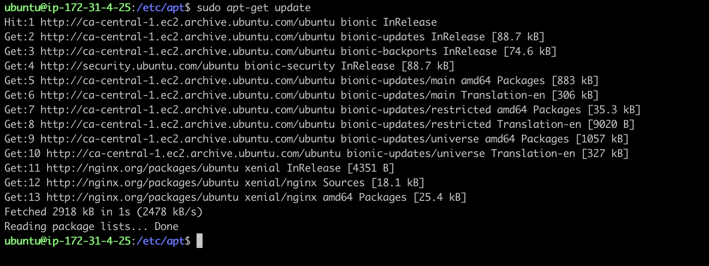

# Nginx Web Server
{: .no_toc }

## Table of contents
{: .no_toc .text-delta }

1. TOC
{:toc}

---

# Introduction
Nginx was first released in 2004, nine years later than Apache; however, it has surpassed Apache since 2016 and become the most widely used web server in the world. Besides being a web server, it can also be used as a reverse proxy, load balancer, mail proxy and HTTP cache, and load balancer is the most popular usage that can be found in modern web stack. 

Nginx is a free and open-sourced software, but there is also a paid version Nginx Plus which provides some exclusive enterprise-grade features. Nginx Plus can be deployed directly from AWS's Marketplace, while in this manual, the focus is on the deployment of the free version of Nginx on AWS EC2 instance.

# Installation
The first two steps are the same for all the installation guidance.

**Step 1.** open a terminal, login to our AWS ubuntu instance.


**Step 2.** (optional) update the repositories and the ubuntu EC2 instance, if we haven't done it when we first login.
```bash
$ sudo apt update -y && sudo apt upgrade -y
```

**Step 3.** Download nginx (GPG) public key
Nginx uses GPG (Gnu Privacy Guard) keys on its RPM packages and Debian/Ubuntu repositories so that users can verify the integrity and origin of the downloaded package. 
```bash
$ sudo wget http://nginx.org/keys/nginx_signing.key
```


**Step 4.** Add the key to APT key management utility

```bash
$ sudo apt-key add nginx_signing.key
```

**Step 5.** Create list file for Nginx
*source.list* is the main Apt sources configuration file in Linux system. We can use any text editor to open it in the directory */etc/apt/*.
```bash
$ cd /etc/apt   
$ ls
$ sudo nano sources.list
```
append the following two lists at the end.
> Caution: **bionic** represents the Ubuntu version, here is 18.04. Change this value according to Ubuntu version. 
```
deb [arch=amd64] http://nginx.org/packages/mainline/ubuntu/ bionic nginx
deb-src http://nginx.org/packages/mainline/ubuntu/ bionic nginx
```


**Step 6.** Update local package database
```bash
$ sudo apt-get update
```

**Step 7.** Install Nginx
```bash
$ sudo apt-get install nginx
```


**Step 8.** Start Nginx service
```bash
$ sudo service nginx start
```

**Step 9.** Open 
Check whether we are able to access the default web page by entering the public dns or IP address of our instance in any browser.

>**Trouble shooting:**
If the server does not start properly, we can use below command to check the server status.

```bash
$ systemctl status nginx.service
```

This command will print out the service status, as well as first few log lines, which is very useful for targeting the problem when something goes wrong.  

In the screenshot above, the log message shows the service failed to start due to default address:0.0.0.0:80 has already been in use, which could be caused by another web server, like Apache, listening to the same port. Enter following command to list the applications and the associated ports they are listening to.
```bash
$sudo lsof -i -P -n | grep LISTEN
```

After we find out the application that occupies the address, Apache in this case, we have two options to resolve the problem:
1. stop the currently running service, and restart Nginx again. 
2. modify Nginx' configuration to bind to another port.
Here, We stop Apache first to test if Nginx installed correctly. We will introduce the second solution later.

If no error message prints out, goes back to repeat step 9 again. We shall be able to see the default web page.

# Configuration

Nginx comes with two configuration files, demonstrated below:


The main file *nginx.conf* is placed under the Nginx root directory */etc/nginx/*, which contains directives and their parameters.


Another is a feature-specific file *default.conf* stored in */etc/nginx/conf.d/*. 


This file includes web server's default configuration, such as port number, server_name or domain name, absolute path to the website content. 
Here, we can modify the port number to make our Nginx server listen to another port rather than 80,

These two files only provide basic configuration. When more complicated setting is required, the best practice is to split the setting into small feature-specific configuration files, and use *include* directive to refer the content into the main configuration file *nginx.conf*. By doing so, we can simplifier the maintenance work.
